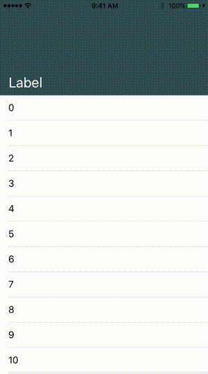

# SimpleCollapsingHeaderView

[](https://travis-ci.org/nixsm/SimpleCollapsingHeaderView)
[](http://cocoapods.org/pods/SimpleCollapsingHeaderView)
[](http://cocoapods.org/pods/SimpleCollapsingHeaderView)
[](http://cocoapods.org/pods/SimpleCollapsingHeaderView)

A Simple collapsing header view based on this [post](https://michiganlabs.com/ios/development/2016/05/31/ios-animating-uitableview-header/)



## Usage

1. Open o storyboard or Xib file.
2. Drag and drop a `UIView` to a ViewController
3. In Identity Inspector, replace the class from `UITextField` to `SimpleCollapsingHeaderView` and the module to `SimpleCollapsingHeaderView`.
4. Configure `Min Height` and `Max Height` in the Attribute Inspector
5. Add the following constraints:
	- Trailing Space to Superview
	- Leading Space to Superview
	- Top Space to Superview
	- Height equal to `Max Height` property (Unfornutately I still haven't figured a way to update the height constraint based on the `@IBInspectable`)
6. Connect the `Height Constraint` to the `headerHeightConstraint` of the `SimpleCollapsingHeaderView`
7. Connect the `SimpleCollapsingHeaderView` to you ViewController
8. Call `collapseHeaderView(using: scrollView)` inside your `scrollViewDidScroll(_ scrollView: UIScrollView)` method

### Animations

Animations can be done by implementing the `SimpleCollapsingHeaderViewDelegate`, the `onHeaderDidAnimate` returns the percentage of how much the Header view is collapsed

A simple animation can be found inside the example Project

## Example

To run the example project, clone the repo, and run `pod install` from the Example directory first.

## Requirements

- Minimum iOS version required: 9.0

## TODOs

- Implement the previous scroll inset in a way that you can have more than 1 scrollView resizing the Header View

## Installation

SimpleCollapsingHeaderView is available through [CocoaPods](http://cocoapods.org). To install
it, simply add the following line to your Podfile:

```ruby
pod 'SimpleCollapsingHeaderView'
```

## Author

Nicholas Meschke, nichsmm@gmail.com

## License

SimpleCollapsingHeaderView is available under the MIT license. See the LICENSE file for more info.
